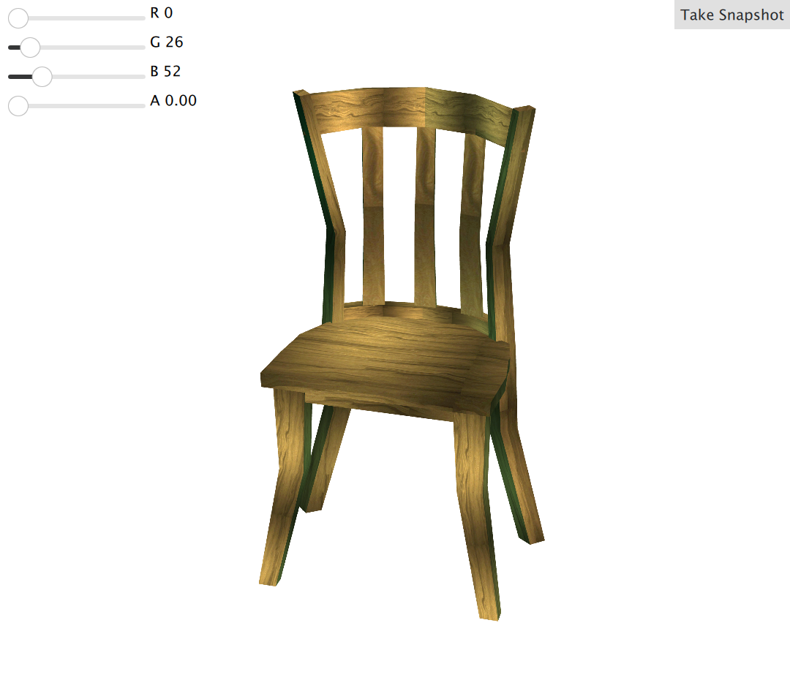
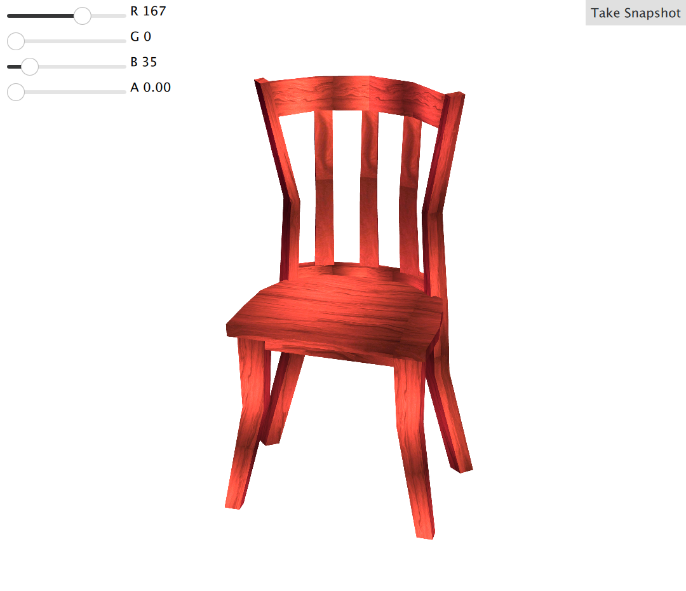

# qmlsnapshot

qmlsnapshot is a simple and open source Qt/C++ library which can be used in QML to take screenshots of a QML view. It includes also a function to provide the current Desktop path.

# Build

qmlsnapshot lib uses qmake for building.
To build it run:  
``
path/to/your/Qt/bin/qmake
``  

and then:  
``make``

# Usage

QMLSnapShot.captureWindow(QVariant data) - Takes screenshot of the chosen Item in the qml view
StandardPaths.getDesktopDir() - Returns the path to the Desktop location
StandardPaths.getHomeDir() - Returns the path to the Home location

# Example

The example embeds a 3d scene inside a qt quick ui and integrates qmlsnapshot as a 3rd party library.

A simple 3d object together with 4 sliders from which the values are representing the RGBA color values. While the values are changing, the object is affected applying the color combinations on its texture.

A "Print Scene" button is available to take a screenshot of the object and save it in the Desktop location in png format, including in its naming the hex value of the rgba color applied.

# Building the Example
``mkdir build && cd build``

From the *build/* folder, run:  
``
path/to/your/Qt/bin/qmake ../example/
``  

then:  
``make && make install``

This will create the *qmlsnapshotexample* executable under the *qmlsnapshotexample* directory inside the build folder.

# Running the example
From the *build/* folder, run
``
./qmlsnapshotexample/qmlsnapshotexample
``

#### wooden_chair_color_1a34.png  
  
#### wooden_chair_color_a70023.png  

# License

This software is available under the following license:

MIT

# Special thanks
Special thanks to http://ghantee.com/royalty-free-3d-models/wooden-chair/ for providing free 3d models.
